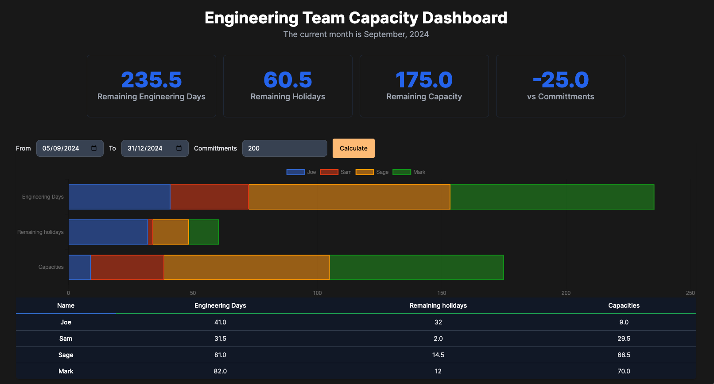

In my journey as a software engineer manager, I've experienced the complexities of engineering resource planning firsthand. The challenges are multifaceted: managers must account for bank holidays, employee absences, holiday allowances, and sick leaves. Additionally, some team members split their time between management and individual contributions (like myself sometime), further complicating the equation.

## Why do we need to do resources plan?
Wait a minute, what is resources plan and why do we need to do it in the first place? In definition from [Project Management Institute](https://www.pmi.org/learning/library/resource-planning-project-management-10567),

> Resources plan is a process of determining the resources required to complete the project. It is a critical part of project management that involves estimating the resources needed to complete the project. Resources plan helps to ensure that the project is completed on time and within budget. It also helps to identify any potential risks that may arise during the project.

Very formal. My version of it is, as an engineering manager, you need to know the capacity of your team, so that you can plan the work accordingly. You don't want to overcommit your team, and get them burned out. You also don't want to underutilize them, and miss the deadlines.

## The Problem
Resource planning in engineering is not as simple as just counting heads. The number of available workdays fluctuates due to:

- Bank Holidays: These vary by region and can significantly impact capacity.
- Absences and Sick Leaves: Unplanned or planned time off reduces availability.
- Holiday Allowances: Employees may have unused holiday time that needs to be scheduled.
- Mixed Roles: Some team members, such as engineering managers, might contribute only part-time to hands-on work, requiring an adjustment to their capacity.

To address these pain points, I developed the Engineering Capacity Planner. This tool helps engineering managers calculate their team's capacity over a given date range, balancing current commitments with available resources. By factoring in all variables, it provides a clear picture of what your team can realistically achieve.

## The Solution
The Engineering Capacity Planner considers all these factors, allowing you to:

- Track Absences: Ensure every absence is accounted for in your planning.
- Factor in Holidays: Include public and bank holidays for accurate capacity calculations.
- Adjust for Mixed Roles: Assign an "engineering factor" to employees who split their time between coding and other responsibilities.
- Calculate Capacity vs. Commitment: Quickly see the remaining capacity versus the planned work for any given time range.

See this repository for the solution: https://github.com/JIAZHEN/em-capacity-app

## Conclusion

Now we can answer the question: "How much work can my team realistically achieve?" The Engineering Capacity Planner provides a clear answer. "From today to the end of the year, we have 1000 days of capacity, but we've already committed to 200 days of work."
