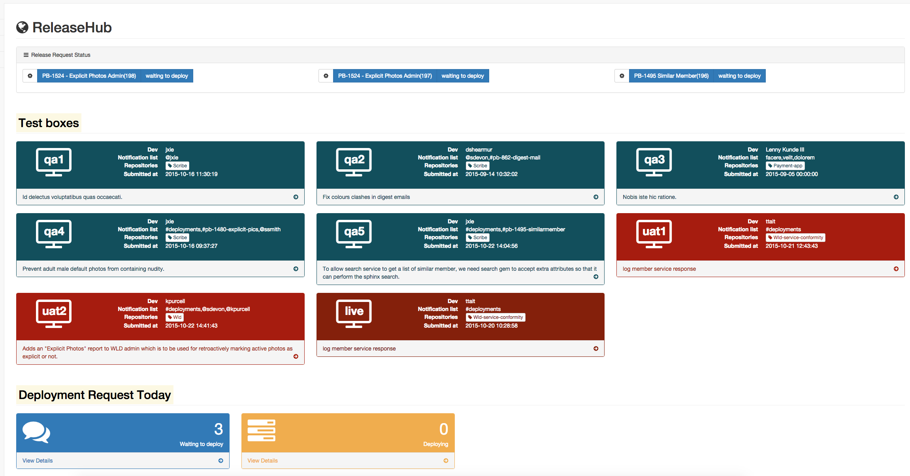

## Motivation
With three scrum teams at Venntro, we are very reasonable to push code mutiple times a day to variety of different environments. In order to get fast and easy deploys, we submit release rquest including github repository name, branch name etc via google form.

However, with the google form nothing is handy (in this case). Developers have to manually fill in all fields, copy & paste the github commit SHA (and double check it is the correct). In the meantime, Ops maintain the form every time we add a new repo, and work with google script to save the request in google spreadsheet with no choice.

_Time is money_, hence nspired by [Tim Blair](http://tim.bla.ir/), [Sam Barnes](http://www.thesambarnes.com/) and [shipit](http://shopifyengineering.myshopify.com/blogs/engineering/79963972-introducing-shipit), I implemented ReleaseHub. And after months of improvement and internal use, we're excited to open-source our deployment tool, ReleaseHub. [demo](https://releasehub.herokuapp.com/).

## Time and money saving
In my careful comparison test, it takes 55 seconds to complete a release request via the google form while ReleaseHub just needs 20 seconds. Secondly, google form has no way to notify our Ops team that the request is waiting to deploy, it could waste up to 40 minutes in waiting. ReleaseHub can eliminate this risk by integrated Slack notification. 

In general ReleaseHub will save us up to 0.6763 hour (40 mins and 35 seconds), even with the current minimum wage £7 per hour, the potential cost of per release request is about £4.73. 

On avergage we have 280 reqeusts per month, indicates that potentially we could save £1,325.5 monthly if this google form is replaced by a simple app! We are not creating revenues, but, the money we save means we can efficiate our work and the company investment. Overall, I believe it is really a tool that can helps the development team.

## Concolusion
ReleaseHub is assuming that the dev team is using github as the source control and slack for internal team communication. Here is the demo link - [ReleaseHub](https://releasehub.herokuapp.com/), the [wiki pages](https://github.com/JIAZHEN/releasehub/wiki), and of course, the [github repository](https://github.com/JIAZHEN/releasehub)

Please feel free to drop me a line and let me know what you think.
